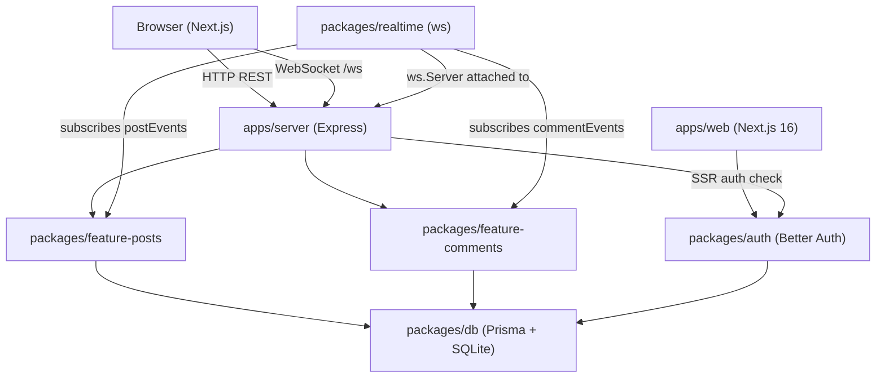

# Design Document: Posts and Comments

## Overview

This document describes the technical design for the **Posts/Feed** and **Comments** features on CampusHub. The system enables authenticated users to create posts, browse a reverse-chronological feed, like posts, and comment on posts. Real-time updates are delivered to connected browser clients via WebSocket.

The implementation spans two isolated feature packages (`feature-posts`, `feature-comments`), a new `realtime` package, an Express server (`apps/server`), and a Next.js web app (`apps/web`). Most of the server-side logic is already implemented; the remaining work covers auth middleware hardening, the `feature-comments` shared/client modules, the global feed page, and the realtime package.

### Key Design Decisions

- **Auth middleware in `apps/server`**: Session validation using Better Auth's `auth.api.getSession` lives in the server app, not inside feature packages. This keeps feature packages framework-agnostic and avoids coupling them to the auth package.
- **No cross-feature imports**: `feature-posts` and `feature-comments` never import from each other. The `realtime` package is the only place that imports from both, acting as the integration layer.
- **WebSocket for realtime**: The `ws` package provides a lightweight WebSocket server. Events are broadcast as `{ type, payload }` JSON messages.
- **Feed page follows dashboard pattern**: The `/feed` page uses a server component for the auth guard (redirect to `/login`) and a `"use client"` component for interactive state.

---

## Architecture



### Package Dependency Rules

| Package | May import from |
|---|---|
| `feature-posts` | `@repo/db`, `@repo/env`, `@repo/ui`, `zod`, `express`, `react` |
| `feature-comments` | `@repo/db`, `@repo/env`, `@repo/ui`, `zod`, `express`, `react` |
| `realtime` | `@repo/feature-posts/server`, `@repo/feature-comments/server`, `ws` |
| `apps/server` | all feature packages, `@repo/auth`, `better-auth/node` |
| `apps/web` | `@repo/feature-posts/client`, `@repo/feature-comments/client`, `@repo/auth`, `@repo/ui` |

---

## Components and Interfaces

### Auth Middleware (`apps/server/src/middleware/auth.ts`)

A reusable Express middleware that validates Better Auth sessions on mutating routes.

```typescript
import { auth } from "@repo/auth";
import { fromNodeHeaders } from "better-auth/node";
import type { RequestHandler } from "express";

export const requireAuth: RequestHandler = async (req, res, next) => {
  const session = await auth.api.getSession({
    headers: fromNodeHeaders(req.headers),
  });
  if (!session?.user) {
    return res.status(401).json({ error: "Unauthorized" });
  }
  res.locals.userId = session.user.id;
  next();
};
```

Applied selectively to mutating routes in `apps/server/src/index.ts`:

```typescript
app.post("/api/posts", requireAuth, postRoutes);
app.delete("/api/posts/:postId", requireAuth, postRoutes);
// etc.
```

Alternatively, the middleware can be applied inline within each router using `router.post("/api/posts", requireAuth, handler)`. The preferred approach is to apply it at the server level before mounting routers, or to pass it as a dependency to the router factories. Given the existing router structure, the cleanest approach is to apply `requireAuth` as a route-level middleware inside each feature router, reading `res.locals.userId` instead of the `x-user-id` header.

### Post Service (`packages/feature-posts/src/server/index.ts`)

Already implemented. Changes required:
- Replace `getUserId(req)` (reads `x-user-id` header) with `res.locals.userId` (set by auth middleware).
- Apply `requireAuth` middleware to `POST /api/posts`, `DELETE /api/posts/:postId`, `POST /api/posts/:postId/like`, `DELETE /api/posts/:postId/like`.

Exported interface:
```typescript
export const postRoutes: Router;
export const postEvents: EventEmitter; // emits "post:liked" { postId, userId }
```

### Comment Service (`packages/feature-comments/src/server/index.ts`)

Already implemented. Same changes as Post Service:
- Replace `getUserId(req)` with `res.locals.userId`.
- Apply `requireAuth` to `POST /api/posts/:postId/comments` and `DELETE /api/posts/:postId/comments/:commentId`.

Exported interface:
```typescript
export const commentRoutes: Router;
export const commentEvents: EventEmitter; // emits "comment:new" { commentId, postId, authorId }
```

### Shared Modules

**`packages/feature-posts/src/shared/index.ts`** — already complete:
- Exports: `createPostSchema`, `feedQuerySchema`, `Post`, `Like`, `FeedPost`, `CreatePostInput`

**`packages/feature-comments/src/shared/index.ts`** — already complete:
- Exports: `createCommentSchema`, `Comment`, `CreateCommentInput`

### Client Hooks

**`packages/feature-posts/src/client/`** — already complete:
- `useFeed(page, limit)` → `{ posts: FeedPost[], loading, error, refresh }`
- `usePost(postId)` → `{ post: FeedPost | null, loading, error }`

**`packages/feature-comments/src/client/`** — already complete:
- `useComments(postId)` → `{ comments: Comment[], loading, error, refresh }`

### Realtime Package (`packages/realtime/`)

New package. Structure:

```
packages/realtime/
  package.json
  tsconfig.json
  src/
    index.ts
```

`src/index.ts` exports:

```typescript
import { WebSocketServer, WebSocket } from "ws";
import type { Server } from "node:http";
import { postEvents } from "@repo/feature-posts/server";
import { commentEvents } from "@repo/feature-comments/server";

export function attachRealtime(server: Server): void {
  const wss = new WebSocketServer({ server, path: "/ws" });
  const clients = new Set<WebSocket>();

  wss.on("connection", (ws) => {
    clients.add(ws);
    ws.on("close", () => clients.delete(ws));
  });

  const broadcast = (type: string, payload: unknown) => {
    const msg = JSON.stringify({ type, payload });
    for (const client of clients) {
      if (client.readyState === WebSocket.OPEN) {
        client.send(msg);
      }
    }
  };

  postEvents.on("post:liked", (payload) => broadcast("post:liked", payload));
  commentEvents.on("comment:new", (payload) => broadcast("comment:new", payload));
}
```

### Feed Page (`apps/web/src/app/feed/`)

Two files following the dashboard pattern:

**`page.tsx`** (server component — auth guard):
```typescript
import { headers } from "next/headers";
import { redirect } from "next/navigation";
import { authClient } from "@/lib/auth-client";
import FeedClient from "./feed-client";

export default async function FeedPage() {
  const session = await authClient.getSession({
    fetchOptions: { headers: await headers(), throw: true },
  });
  if (!session?.user) redirect("/login");
  return <FeedClient session={session} />;
}
```

**`feed-client.tsx`** (`"use client"` — interactive feed):
- Uses `useFeed` from `@repo/feature-posts/client`
- Renders a list of `FeedPost` items
- Renders a post creation form with `content` (Textarea) and optional `imageUrl` (Input) fields
- On submit: calls `POST /api/posts`, calls `refresh()` on success
- Validates that content is non-empty before submitting
- Shows loading indicator (`<Loader />` or spinner) while `loading === true`
- Shows error message when `error !== null`

---

## Data Models

All models are already defined in `packages/db/prisma/schema/`.

### Post

```prisma
model Post {
  id        String    @id @default(cuid())
  content   String
  imageUrl  String?
  authorId  String
  author    User      @relation(fields: [authorId], references: [id], onDelete: Cascade)
  likes     Like[]
  comments  Comment[]
  createdAt DateTime  @default(now())
  updatedAt DateTime  @updatedAt

  @@index([authorId])
  @@map("post")
}
```

### Like

```prisma
model Like {
  id        String   @id @default(cuid())
  postId    String
  post      Post     @relation(fields: [postId], references: [id], onDelete: Cascade)
  userId    String
  user      User     @relation(fields: [userId], references: [id], onDelete: Cascade)
  createdAt DateTime @default(now())

  @@unique([postId, userId])
  @@index([postId])
  @@index([userId])
  @@map("like")
}
```

### Comment

```prisma
model Comment {
  id        String   @id @default(cuid())
  content   String
  postId    String
  post      Post     @relation(fields: [postId], references: [id], onDelete: Cascade)
  authorId  String
  author    User     @relation(fields: [authorId], references: [id], onDelete: Cascade)
  createdAt DateTime @default(now())
  updatedAt DateTime @updatedAt

  @@index([postId])
  @@index([authorId])
  @@map("comment")
}
```

### Validation Schemas

**`createPostSchema`**:
- `content`: `string`, min 1, max 2000
- `imageUrl`: optional `string().url()`

**`feedQuerySchema`**:
- `page`: coerced positive integer, default 1
- `limit`: coerced positive integer, max 50, default 20

**`createCommentSchema`**:
- `content`: `string`, min 1, max 1000

---

## Correctness Properties

*A property is a characteristic or behavior that should hold true across all valid executions of a system — essentially, a formal statement about what the system should do. Properties serve as the bridge between human-readable specifications and machine-verifiable correctness guarantees.*

Property-based testing applies here because the feature contains pure validation logic (Zod schemas), ordering/pagination logic, event emission logic, and WebSocket broadcast logic — all of which have universal properties that hold across a wide input space and where 100 iterations reveal more bugs than 2-3 examples.

The chosen PBT library is **fast-check** (TypeScript-native, works with Vitest).

---

### Property 1: Post schema accepts all valid inputs

*For any* non-empty string up to 2000 characters (with or without a valid `imageUrl`), `createPostSchema.parse()` SHALL succeed and return the input unchanged.

**Validates: Requirements 9.3**

---

### Property 2: Post schema rejects all invalid inputs

*For any* string that is empty, exceeds 2000 characters, or any `imageUrl` that is not a valid URL, `createPostSchema.parse()` SHALL throw a `ZodError`.

**Validates: Requirements 4.6, 9.3**

---

### Property 3: Comment schema accepts all valid inputs

*For any* non-empty string up to 1000 characters, `createCommentSchema.parse()` SHALL succeed and return the input unchanged.

**Validates: Requirements 9.4**

---

### Property 4: Comment schema rejects all invalid inputs

*For any* string that is empty or exceeds 1000 characters, `createCommentSchema.parse()` SHALL throw a `ZodError`.

**Validates: Requirements 6.5, 9.4**

---

### Property 5: Feed is always in reverse-chronological order

*For any* collection of posts with distinct `createdAt` timestamps, the feed returned by `GET /api/posts` SHALL be ordered such that `posts[i].createdAt >= posts[i+1].createdAt` for all consecutive pairs.

**Validates: Requirements 4.2**

---

### Property 6: Feed pagination returns the correct slice

*For any* total number of posts N, page P, and limit L, the feed response SHALL contain at most L posts, and the posts returned SHALL correspond to the correct offset `(P-1)*L` in the reverse-chronological sequence.

**Validates: Requirements 4.2**

---

### Property 7: Post creation round-trip preserves content

*For any* valid post input `{ content, imageUrl? }`, creating a post via `POST /api/posts` and then fetching it via `GET /api/posts/:postId` SHALL return a post whose `content` and `imageUrl` fields equal the original input.

**Validates: Requirements 4.1, 4.3**

---

### Property 8: Like creation emits correct event payload

*For any* `postId` and `userId`, when a like is created via `POST /api/posts/:postId/like`, the `post:liked` event emitted on `postEvents` SHALL have a payload of exactly `{ postId, userId }`.

**Validates: Requirements 5.1, 7.3**

---

### Property 9: Comment creation emits correct event payload

*For any* valid comment input and `postId`, when a comment is created via `POST /api/posts/:postId/comments`, the `comment:new` event emitted on `commentEvents` SHALL have a payload of exactly `{ commentId, postId, authorId }` matching the created comment.

**Validates: Requirements 6.1, 7.4**

---

### Property 10: Comments are always in chronological order

*For any* collection of comments on a post with distinct `createdAt` timestamps, the response from `GET /api/posts/:postId/comments` SHALL be ordered such that `comments[i].createdAt <= comments[i+1].createdAt` for all consecutive pairs.

**Validates: Requirements 6.2**

---

### Property 11: Realtime broadcast delivers correct message structure

*For any* event type (`"post:liked"` or `"comment:new"`) and any payload object, when the event is emitted on the corresponding `EventEmitter`, all connected WebSocket clients SHALL receive a JSON message with `{ type: <event-type>, payload: <original-payload> }`.

**Validates: Requirements 13.2, 13.3, 13.8**

---

### Property 12: Connection pool tracks clients accurately

*For any* number of WebSocket clients N that connect and then M that disconnect (M ≤ N), the active connection pool SHALL contain exactly N − M clients.

**Validates: Requirements 13.5, 13.6**

---

## Error Handling

### HTTP Error Responses

All API routes return JSON error objects in the form `{ error: string | ZodIssue[] }`.

| Scenario | Status |
|---|---|
| Missing or invalid session on mutating route | 401 |
| Authenticated user attempts to delete another user's post/comment | 403 |
| Post or comment not found | 404 |
| Duplicate like | 409 |
| Zod validation failure | 400 |
| Unexpected server error | 500 |

### Auth Middleware Error Handling

- `auth.api.getSession` may throw if the auth service is unavailable. The middleware wraps the call in a try/catch and returns 500 on unexpected errors.
- If the session exists but `session.user` is null/undefined, the middleware returns 401.

### Realtime Error Handling

- WebSocket send errors (e.g., client disconnected mid-send) are caught per-client and the client is removed from the pool.
- Event emitter errors do not propagate to HTTP request handlers.

### Feed Page Error Handling

- `useFeed` exposes an `error` string when the fetch fails; `FeedClient` renders this as a visible error message.
- Form validation errors (empty content) are shown inline without making a network request.

---

## Testing Strategy

### Unit Tests (Vitest)

Focus on specific examples, edge cases, and error conditions:

- Auth middleware: valid session → userId attached; missing session → 401; invalid session → 401.
- Post routes: 403 on non-author delete; 404 on missing post; 409 on duplicate like; 404 on unlike without like.
- Comment routes: 403 on non-author delete.
- Feed page component: renders posts; shows loading state; shows error state; shows validation error on empty submit; redirects unauthenticated users.

### Property-Based Tests (Vitest + fast-check)

Each property test runs a minimum of **100 iterations**. Tests are tagged with:
`// Feature: posts-and-comments, Property <N>: <property text>`

- **Property 1 & 2**: `createPostSchema` accepts/rejects inputs — generate strings of varying length and URL/non-URL values.
- **Property 3 & 4**: `createCommentSchema` accepts/rejects inputs — generate strings of varying length.
- **Property 5 & 6**: Feed ordering and pagination — generate N posts with random timestamps, verify ordering and slice correctness using an in-memory mock of the Prisma query.
- **Property 7**: Post creation round-trip — generate valid post inputs, create via handler (with mocked Prisma), fetch back, verify fields match.
- **Property 8**: Like event payload — generate random postId/userId pairs, trigger like handler (mocked Prisma), capture emitted event, verify payload.
- **Property 9**: Comment event payload — generate random comment inputs and postId, trigger comment handler (mocked Prisma), capture emitted event, verify payload.
- **Property 10**: Comment ordering — generate N comments with random timestamps, verify chronological order.
- **Property 11**: Realtime broadcast structure — generate random payloads for both event types, emit on EventEmitter, verify all mock WebSocket clients receive correctly structured JSON.
- **Property 12**: Connection pool accuracy — connect N mock clients, disconnect M, verify pool size.

### Integration Tests

- Cascade deletes: create user → create posts/comments/likes → delete user → verify all cascade-deleted.
- Route mounting: verify all expected endpoints respond (no 404 from routing conflicts).
- Auth end-to-end: real Better Auth session cookie → mutating route succeeds; no cookie → 401.

### Smoke Tests

- Package exports: verify `feature-posts` and `feature-comments` export the required entry points.
- No cross-feature imports: static check that `feature-posts` does not import `@repo/feature-comments` and vice versa.
- `postEvents` and `commentEvents` are `EventEmitter` instances.
- `attachRealtime` is exported as a function.
